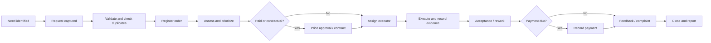

# CP-00 discovery

## Objective

Establish an evidence-backed and commercially small starting point for an MCK
Telegram product before committing to a database schema or implementation stack.

## Repository audit

The workspace was empty at the start of CP-00:

- no Git metadata;
- no package or dependency manifest;
- no application code;
- no tests or CI configuration;
- no Docker or environment configuration;
- no existing documentation.

The project is greenfield. Local tools observed during discovery include Git,
Node.js, npm, pnpm, Docker, Docker Compose, and Python. Tool availability does not
constitute approval of a technology decision.

## Source inspected

Source: `C:\Users\Lenovo\Documents\6-Модул - Буюртмалар портфели.pptx`

Inspection method:

- inspected the Open XML package directly;
- extracted text from all 17 slides and available notes;
- verified the relationships from slides 3–10 to their eight embedded images;
- visually inspected all eight image-only slides;
- observed no charts or embedded workbooks.

The presentation is educational material with practical cases and process
infographics. It provides strong business direction, but it is not a formal
specification: it does not define identities, authorization, exact transition
preconditions, data retention, or error handling.

## Presentation findings

| Evidence     | Business meaning                                                                                                                                                        |
| ------------ | ----------------------------------------------------------------------------------------------------------------------------------------------------------------------- |
| Slides 1–2   | Scope: needs discovery, portfolio creation, service chain, quality control, KPI and improvement.                                                                        |
| Slide 3      | Needs originate through household visits, street/building representatives, Telegram and telephone; demand is grouped into service categories.                           |
| Slide 4      | Portfolio classification uses service type, territory, deadline, executor and revenue source; priority bands are urgent, important and planned.                         |
| Slide 5      | Every request is registered before service; a register captures customer, address, service, contact, deadline and execution status; weekly review follows.              |
| Slide 6      | Service chain: intake, assessment, price agreement, executor assignment, execution, acceptance record, payment and feedback.                                            |
| Slide 7      | An alternative commercial flow includes assignment, contract, execution, acceptance certificate, payment and document/report filing.                                    |
| Slide 8      | Quality includes timeliness, safety, materials, standards, warranty, acceptance, feedback and complaint reinspection.                                                   |
| Slide 9      | Portfolio analysis covers received, completed, overdue, cancelled, revenue, expense, complaints, repeat customers and PDCA actions.                                     |
| Slide 10     | Revenue may come from residents, organizations, grants, social funding and additional services.                                                                         |
| Slides 12–16 | Cases require source confidence, deduplication, prioritization under resource limits, responsible people/deadlines, escalation, checklists, satisfaction, KPI and PDCA. |

## Canonical business interpretation

The two service-chain variants are reconciled by treating pricing, contract and
payment as conditional commercial steps rather than mandatory states for every
order:

This is a proposed interpretation for the MVP, not an assertion that the slides
define a complete state machine.

## Actors for the sell-first pilot

| Actor                | Pilot responsibility                                                               |
| -------------------- | ---------------------------------------------------------------------------------- |
| Resident             | Submit and track a request, provide information, accept work, rate or complain.    |
| Operator/Manager     | Validate, request information, confirm duplicates, prioritize, assign and inspect. |
| Executor             | Accept work, update progress, record blockage and submit completion evidence.      |
| System Administrator | Link approved staff identities, manage configuration and investigate failures.     |

Separate supervisor, inspector, finance, contractor and auditor permissions remain
part of the future model, but pilot users may hold combined roles.

## Product hypothesis

MCK will pay for a Telegram-first product if it can demonstrate that requests are
not lost, responsibility is visible, duplicate work is reduced, residents receive
status updates, and management can see a trustworthy weekly summary.

The pilot should test that hypothesis before funding finance automation, a web
dashboard, external integrations or advanced analytics.

## Discovery conclusion

The smallest credible product is one end-to-end request-to-acceptance workflow for
one mahalla and a small service catalog. It should use two Telegram bot identities
in one application process, PostgreSQL for transactional integrity and long polling
to avoid public hosting requirements during the first pilot.
