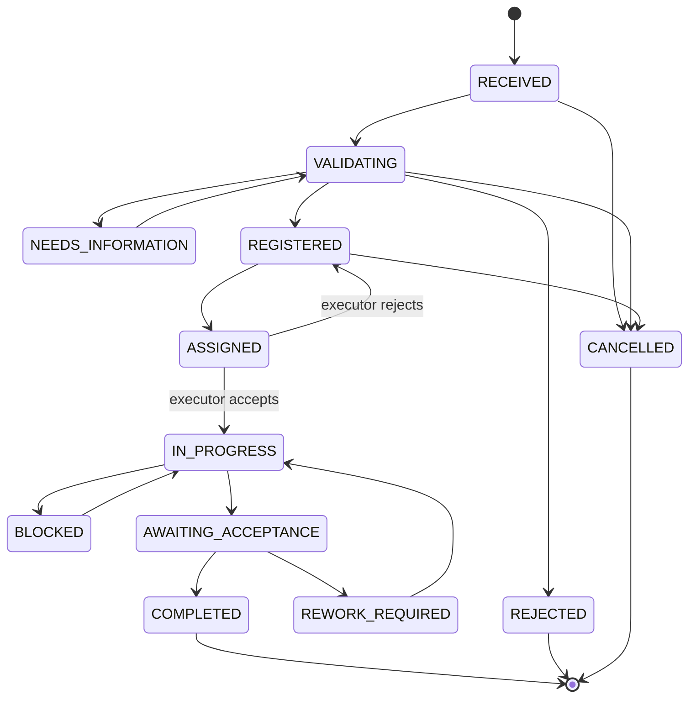

# Business requirements

## Product outcome

Provide MCK with a single, auditable operational register that turns resident
requests into assigned and accepted work while keeping residents and managers
informed.

## MVP business requirements

### Intake and identity

- **BR-001:** Preserve the original source of every request.
- **BR-002:** Let a resident choose an approved language and accept a versioned
  privacy notice before providing personal data.
- **BR-003:** Capture a Telegram identity, shared phone contact, service category,
  description and address or Telegram location.
- **BR-004:** Accept a small, controlled set of photo attachments.
- **BR-005:** Present a review step before submission and return a human-readable
  ticket number.
- **BR-006:** Process each Telegram update and confirmed submission at most once,
  including during retries and concurrency.

### Registration and portfolio

- **BR-007:** Register every accepted request before service work begins.
- **BR-008:** Configure service categories and service areas as data rather than
  scattering them through bot handlers.
- **BR-009:** Preserve separate resident requests when they refer to one shared
  problem, and let an authorized operator link them to a common order.
- **BR-010:** Classify orders by category, location, deadline, responsible executor,
  priority, status and revenue/funding source where relevant.

### Validation and prioritization

- **BR-011:** Permit an authorized operator to validate, reject, request more
  information, register or confirm a duplicate candidate.
- **BR-012:** Calculate explainable priority from versioned factors and preserve each
  factor, score, band and explanation.
- **BR-013:** Separate impact priority from scheduling feasibility so expensive work
  is not incorrectly treated as unimportant.
- **BR-014:** Require permission and a reason for manual priority overrides.

### Execution and quality

- **BR-015:** Assign an order to an executor with a target deadline and explicit
  acceptance or rejection.
- **BR-016:** Let an executor record in-progress, blocked and completion updates with
  optional photo evidence.
- **BR-017:** Route all lifecycle changes through one application/domain state
  machine with authorization, concurrency control and audit history.
- **BR-018:** Let an operator or resident accept completed work or require rework.
- **BR-019:** Capture a 1–5 rating, optional comment and complaint.

### Commercial records and documents

- **BR-025:** Classify an order as no-charge or fixed-price and preserve its configured revenue
  source.
- **BR-026:** Issue an auditable fixed-price quotation in whole UZS with labor, material and other
  components, a scope, validity date and explicit customer-approval reference.
- **BR-027:** Record a reference to an externally executed contract without claiming to create an
  electronic signature or legally binding digital contract.
- **BR-028:** Generate an acceptance-certificate record only after operational acceptance and order
  completion, and enforce a required contract reference where configured.
- **BR-029:** Record manual confirmed payments and expenses with dates, classifications and evidence
  references; a payment must not exceed the accepted quotation total.
- **BR-030:** Calculate agreed revenue, collection, recorded expense, outstanding amount and
  operational gross margin using exact integer money. Do not label this tax, net-profit or statutory
  accounting output.
- **BR-031:** Store generated pilot text documents immutably with a SHA-256 checksum and area-scoped
  access. External payment and document-storage providers remain disabled.

### Communication and operation

- **BR-020:** Notify a resident of material status changes through reliable,
  retryable delivery.
- **BR-021:** Give staff only the operations and organizational scope they are
  authorized to use; Telegram buttons are not an authorization boundary.
- **BR-022:** Produce a simple weekly operational summary from defined data.
- **BR-023:** Record sensitive operations, state changes and manual decisions in an
  append-only audit history.
- **BR-024:** Avoid logging tokens, complete phone numbers, complete addresses or raw
  resident content unless specifically required for controlled diagnostics.

## Proposed MVP lifecycle

The lifecycle is provisional until CP-02 defines every transition and test:

`OVERDUE` is derived from a deadline. Duplicate detection is a relationship and
review outcome. Contract and payment status belong to optional commercial records.

## Proposed priority model

| Criterion                          | Weight | Meaning                                                       |
| ---------------------------------- | -----: | ------------------------------------------------------------- |
| Safety risk                        |    30% | Threat to life, health, property or essential infrastructure. |
| Residents affected                 |    25% | Number of households and degree of community impact.          |
| Service interruption/urgency       |    20% | Inability to use an essential service or rapid deterioration. |
| Deadline/seasonal impact           |    15% | Operational, promised, seasonal or later legal deadline.      |
| Repeat frequency/source confidence |    10% | Repeated verified reports and reliability of evidence/source. |

Each factor uses a documented 1–5 scale. Score versions are immutable once used.
Resource availability and estimated cost affect scheduling decisions and are shown
alongside the impact score.

## Pilot service-level targets

These are internal, configurable targets—not contractual promises:

- urgent safety reports: operator acknowledgement target of 15 minutes during
  configured working hours and immediate escalation;
- important work: assessment target within one working day and desired execution
  within 1–3 working days where resources allow;
- planned work: a visible scheduled date;
- notification failures: visible to staff for retry or correction.

## Deferred business capabilities

- online payments;
- legally binding electronic contracts or signatures;
- statutory accounting, tax and net-profit automation;
- multi-organization and grant contract administration beyond revenue-source classification;
- warranty automation beyond a basic complaint/rework link;
- advanced visual/immutable KPI dashboards and automated PDCA recommendations (basic Telegram/CSV
  reporting and auditable manual PDCA are implemented in CP-08);
- contractor portal, administrative web UI and external integrations.
