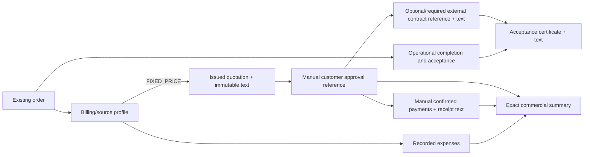

# Commercial records and documents

## Pilot boundary

CP-09 adds an optional commercial record to an existing order. It does not change the canonical
request/order state machines. Operational execution and quality acceptance remain authoritative;
commercial records cannot mark work completed.

The pilot supports one currency (`UZS`), whole-unit amounts, manual evidence references and two
billing modes:

- `NO_CHARGE`: no quotation, contract requirement or payment is permitted; expenses may still be
  recorded for management visibility.
- `FIXED_PRICE`: one active quotation may be issued and explicitly accepted. A contract reference
  can be recorded, and may be required before an acceptance certificate is generated.

Five seeded revenue-source classes are data-driven: resident, organization, grant, social funding
and additional service. These labels classify work; they are not ledger accounts.

## Exact formulas

All money is PostgreSQL `bigint` and TypeScript `bigint` in whole UZS.

| Indicator                | Formula                             | Availability                                       |
| ------------------------ | ----------------------------------- | -------------------------------------------------- |
| Agreed revenue           | accepted quotation total            | only after explicit quotation acceptance           |
| Collected                | sum of confirmed manual payments    | zero when none are recorded                        |
| Recorded expense         | sum of non-void expenses            | zero when none are recorded                        |
| Outstanding              | agreed revenue − collected          | only when revenue is agreed                        |
| Collection rate          | collected ÷ agreed revenue × 100    | basis-point precision; only when revenue is agreed |
| Operational gross margin | agreed revenue − recorded expense   | only when revenue is agreed                        |
| Gross-margin rate        | gross margin ÷ agreed revenue × 100 | basis-point precision; may be negative             |

These are live order-level operational indicators. They are not tax revenue recognition, net
profit, a general ledger, statutory accounting or a closed-period report.

## Transaction and document flow

Each mutation locks the relevant order/profile or quotation, validates the business invariant, and
writes its record, generated document where applicable, and audit entry in one PostgreSQL
transaction. Payments cannot make total confirmed collection exceed the accepted quotation.

## Document storage

Quotation, contract-reference, acceptance-certificate and payment-receipt documents are small
bilingual UTF-8 text snapshots stored in PostgreSQL. Each has a stable `DOC-YYYY-NNNNNNNN` code and
SHA-256 checksum. A database trigger rejects updates and deletes.

This zero-cost store is intentionally limited. It does not accept uploaded contracts, scans or
arbitrary files; it does not create signatures; and it is not independent archival storage. A
future private object-store adapter remains disabled until a paying buyer requires durable binary
documents and funds malware scanning, backup and retention controls.

## Authorization

- `finance.read`: view an order's commercial summary in the same service area.
- `finance.manage`: configure and mutate commercial records in the same service area.
- `document.read`: retrieve generated commercial documents in the same service area.

The combined pilot operator-manager receives these grants. Administrators receive all permissions.
Executors and residents receive none. Telegram buttons are only navigation; services enforce every
grant and scope.
