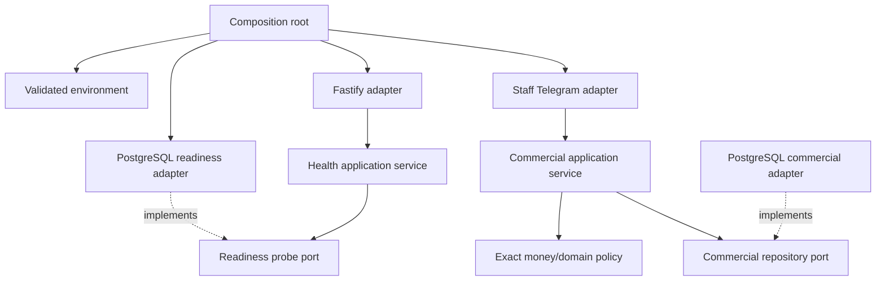

# Foundation components

## Dependency rules

- `domain` imports no application, configuration, infrastructure or interface code.
- `application` imports domain code and declared ports, not concrete adapters.
- `infrastructure` does not import interface adapters.
- `interfaces` call application services and do not contain domain decisions.
- `main.ts` is the composition root and may wire all layers.

`scripts/check-boundaries.mjs` verifies these initial source-level constraints.
