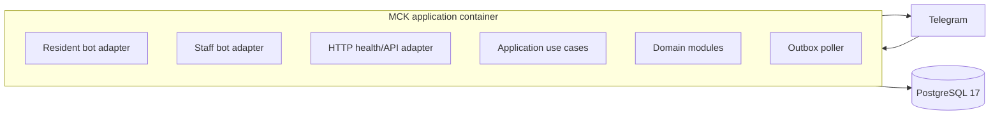

# Container architecture

The same application process hosts the HTTP health adapter, both long-polling Telegram adapters,
the PostgreSQL outbox poller, and the operational scan timer. Database leases, row locks, and an
advisory scan lock make overlapping workers safe, although one process remains the pilot default.

One application container and PostgreSQL instance are sufficient for the pilot.
Production backup data must leave the host; the Compose volume is not a backup.
