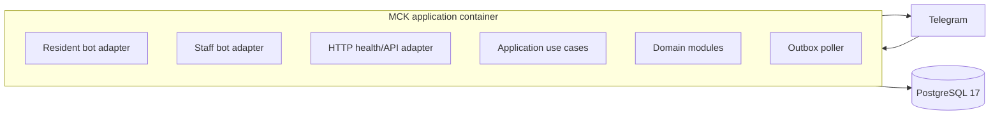

# Container architecture

CP-01 implements only the HTTP health/API foundation and PostgreSQL readiness
adapter. Telegram adapters and the outbox behavior arrive in their assigned
checkpoints.

One application container and PostgreSQL instance are sufficient for the pilot.
Production backup data must leave the host; the Compose volume is not a backup.
