# Initial PostgreSQL data model

## Entity relationships

```mermaid
erDiagram
    SERVICE_AREAS ||--o{ ADDRESSES : contains
    SERVICE_AREAS ||--o{ USER_ROLES : scopes
    SERVICE_AREAS ||--o{ ORDERS : classifies
    USERS ||--o{ USER_ROLES : receives
    ROLES ||--o{ USER_ROLES : granted_as
    ROLES ||--o{ ROLE_PERMISSIONS : includes
    PERMISSIONS ||--o{ ROLE_PERMISSIONS : grants
    USERS ||--o{ SERVICE_REQUESTS : submits
    USERS ||--o| RESIDENT_PROFILES : has
    USERS ||--o{ PRIVACY_CONSENTS : accepts
    USERS ||--o| TELEGRAM_INTAKE_SESSIONS : resumes
    REQUEST_SOURCES ||--o{ SERVICE_REQUESTS : originates
    SERVICE_CATEGORIES ||--o{ SERVICE_REQUESTS : categorizes
    ADDRESSES ||--o{ SERVICE_REQUESTS : locates
    SERVICE_REQUESTS ||--o| ORDER_REQUEST_LINKS : becomes
    ORDERS ||--o{ ORDER_REQUEST_LINKS : consolidates
    SERVICE_CATEGORIES ||--o{ ORDERS : categorizes
    USERS ||--o{ ORDERS : executes
    USERS ||--o| EXECUTOR_PROFILES : has
    EXECUTOR_PROFILES ||--o{ EXECUTOR_CATEGORY_CAPABILITIES : supports
    SERVICE_CATEGORIES ||--o{ EXECUTOR_CATEGORY_CAPABILITIES : requires
    ORDERS ||--o{ ASSIGNMENTS : attempts
    EXECUTOR_PROFILES ||--o{ ASSIGNMENTS : receives
    ORDERS ||--o{ WORK_LOGS : documents
    ORDERS ||--o{ WORK_EVIDENCE : proves
    ORDERS ||--o| ORDER_EXECUTION_SLA_CLOCKS : times
    ORDERS ||--o{ ORDER_ESCALATIONS : escalates
    SERVICE_REQUESTS ||--o{ REQUEST_STATUS_HISTORY : records
    SERVICE_REQUESTS ||--o{ ATTACHMENTS : includes
    ORDERS ||--o{ ORDER_STATUS_HISTORY : records
    USERS ||--o{ AUDIT_LOGS : acts
```

## Tables and purpose

| Group            | Tables                                                                                                                                                | Critical constraints/indexes                                                                                                                            |
| ---------------- | ----------------------------------------------------------------------------------------------------------------------------------------------------- | ------------------------------------------------------------------------------------------------------------------------------------------------------- |
| Access           | `users`, `roles`, `permissions`, `user_roles`, `role_permissions`                                                                                     | unique Telegram ID; active status; unique global/scoped role grants; service-area lookup                                                                |
| Catalog/location | `service_areas`, `service_categories`, `request_sources`, `addresses`                                                                                 | unique stable codes; active flags; valid paired latitude/longitude and ranges                                                                           |
| Intake           | `service_requests`, `request_status_history`                                                                                                          | unique ticket; nonblank description; nonnegative optimistic version; unique request/version history                                                     |
| Telegram intake  | `resident_profiles`, `privacy_consents`, `telegram_intake_sessions`, `telegram_update_receipts`, `attachments`                                        | versioned consent; own contact profile; one resumable session per user; globally unique update/submission IDs; controlled photo sizes/types             |
| Portfolio        | `orders`, `order_request_links`, `order_status_history`                                                                                               | unique order number; nonnegative version; one order per initial request; area/status/deadline and executor/status indexes; unique order/version history |
| Execution        | `executor_profiles`, `executor_category_capabilities`, `assignments`, `work_logs`, `work_evidence`, `order_execution_sla_clocks`, `order_escalations` | available/category-capable executors; one active assignment; controlled evidence; one active deadline escalation                                        |
| Audit            | `audit_logs`                                                                                                                                          | entity and actor timelines; database trigger rejects update/delete                                                                                      |

All IDs are UUIDs generated by PostgreSQL. All event timestamps are timezone-aware. Foreign-key deletion policies prefer `RESTRICT`; only membership/link records owned by a parent use cascade deletion. Audit records intentionally have a polymorphic entity reference and are not deleted with an aggregate.

## Transaction boundary for an order transition

1. Load the current row in a transaction.
2. Update only where ID, expected version, and expected current status match.
3. Increment version and set transition-specific fields.
4. Insert status history using the resulting version.
5. Insert actor-aware before/after audit facts and correlation ID.
6. Commit all three writes or roll them all back.

## Transaction boundary for a Telegram update

1. Claim the global Telegram update ID; a retry reads the stored response.
2. Serialize the resident session with a transaction-scoped advisory lock.
3. Load the active user, session, localized active categories, and optional owner-scoped ticket.
4. Apply the pure intake planner and persist consent/profile/session changes.
5. On confirmation, allocate the ticket sequence and insert address, request, optional photo metadata, initial history, and audit atomically.
6. Clear the submitted conversation draft, store the replayable response, and commit before replying to Telegram.

## Seed baseline

The idempotent seed creates one `DEMO` service area; Plumbing, Electrical, Repair, and Landscaping categories; six request sources; all declared permissions; and Resident, Operator/Manager, Executor, and Administrator roles. It creates no fake residents, staff accounts, executor profiles, or orders.
