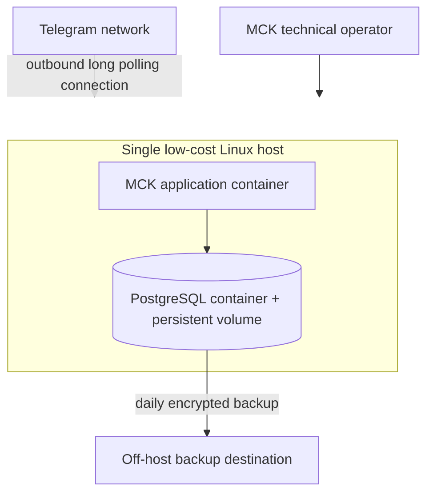

# Pilot deployment baseline

The demonstration may run on a developer computer with synthetic data. A paid pilot
requires a dedicated host, restart policy, restricted management access, persistent
storage, off-host backups, restore verification and alert ownership.

Long polling avoids public application ingress. Health endpoints bind to localhost
in the supplied Compose configuration.
