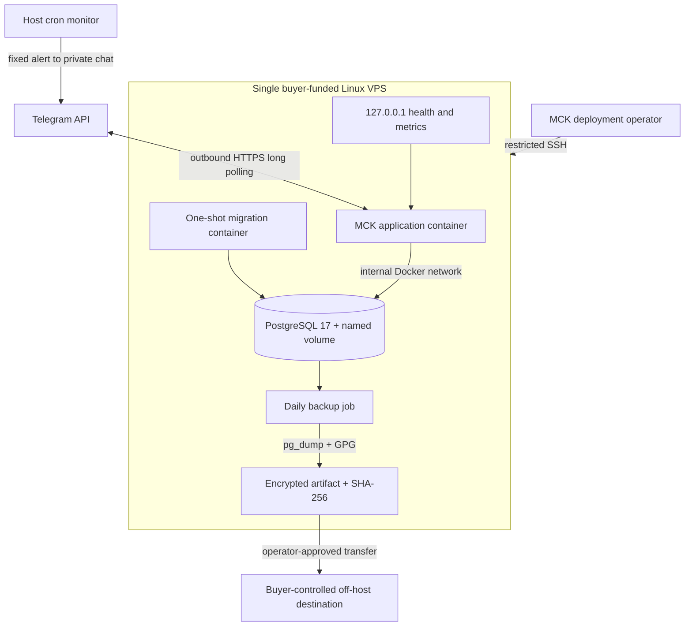

# Pilot deployment baseline

The demonstration may run on a developer computer with synthetic data. A paid pilot
requires a dedicated host, restart policy, restricted management access, persistent
storage, off-host backups, restore verification and alert ownership.

Long polling avoids public application ingress. Health endpoints bind to localhost
in the supplied Compose configuration.

`compose.production.yaml` additionally uses digest-pinned base/database images, read-only application
filesystems, dropped Linux capabilities, `no-new-privileges`, bounded local logs/resources, an
internal database network, file-mounted secrets and an immutable Git release identifier. PostgreSQL
enforces one active Telegram consumer process. The local Compose file remains development-only.
