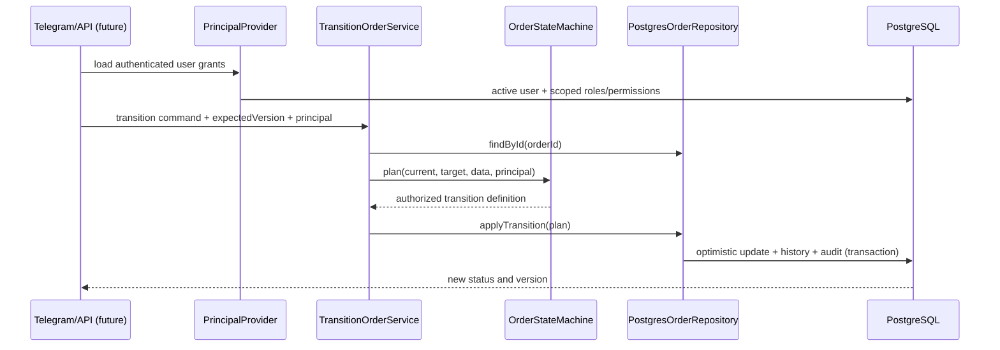

# Domain model

## Canonical terms

- **Service request**: an immutable-in-purpose record of a resident need and its original source. It is validated before operational work exists.
- **Order**: the operational commitment created after a request is registered. Assignment, execution, quality acceptance, cancellation, and SLA behavior belong here.
- **Service area**: the authorization and portfolio boundary for the pilot. A role grant may be global or limited to one service area.
- **Status history**: an append-only record of an accepted transition and resulting aggregate version.
- **Audit log**: an append-only security record containing actor, action, entity, before/after facts, reason, timestamp, and optional correlation ID.

## Aggregate boundaries

| Aggregate       | Owns                                                                                   | Does not own yet                                                   | Consistency boundary                                                                            |
| --------------- | -------------------------------------------------------------------------------------- | ------------------------------------------------------------------ | ----------------------------------------------------------------------------------------------- |
| Service request | source, requester, category, address, validation lifecycle, version                    | prioritization, work execution, payment                            | one request transition plus history/audit in one transaction (repository arrives with CP-03/04) |
| Order           | category/area classification, current executor, deadline, execution lifecycle, version | request intake facts, executor identity, future work logs/evidence | order update, status history, and audit commit atomically                                       |
| Identity/access | user status and global or service-area role grants                                     | Telegram authentication/linking                                    | permissions are loaded by the backend; interfaces do not supply trusted grants                  |
| Catalog         | service areas, categories, request sources                                             | category-specific workflows and prices                             | reference changes are independently versioned in a later admin checkpoint                       |

Requests and orders are deliberately separate. A request can be rejected or cancelled without creating work; a registered request links to exactly one order in the initial model. The unique `order_request_links.request_id` constraint preserves that rule while permitting a future order to consolidate multiple requests.

## Invariants

1. Status changes are planned by a domain state machine and persisted through an application service/repository transaction.
2. The caller supplies an expected version. The update matches ID, current status, and version, then increments the version exactly once.
3. Every committed order transition creates one history row with a unique `(order_id, order_version)` and one audit row.
4. Audit rows cannot be updated or deleted; PostgreSQL enforces this with a trigger.
5. Executor-owned transitions require the actor to be the current executor.
6. Assignment requires an active executor role valid globally or for the order's service area and a future deadline.
7. Scoped grants cannot authorize an operation in another service area; a global grant can.
8. Suspended or disabled users cannot produce an authenticated principal.
9. Resident roles do not receive generic quality permissions; CP-06 grants an in-memory scoped decision only after active identity and request/order ownership checks.
10. Stored timestamps use UTC-capable `timestamptz`; business display/reporting uses `Asia/Tashkent` unless later corrected.
11. Category/source codes are data-driven. User-facing Uzbek Latin and Cyrillic labels are stored as UTF-8 data.

## Application flow

## Deferred model elements

Resident/staff profiles, duplicate matches, priority assessments, assignment history, work evidence,
inspections, acceptances, warranties, feedback, complaints, rework decisions, notification intents,
delivery attempts, and automated alerts now exist through CP-07. Finance and KPI projections remain
assigned to later checkpoints.
