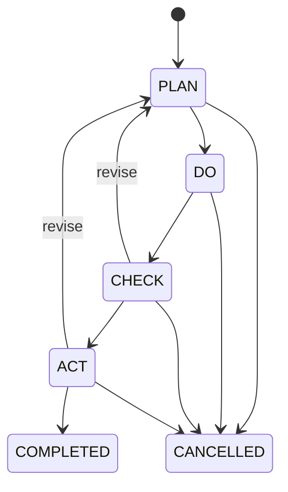

# Operational reporting and PDCA

## Scope and time policy

`/report week|month` returns a compact Telegram summary. `/reportcsv week|month` returns the same
scope as CSV. The report is current-to-date at generation time, not a forecast or closed accounting
period.

- Storage and comparisons: UTC.
- Business timezone: `Asia/Tashkent` (UTC+05:00; no daylight-saving transition).
- Week start: Monday 00:00 local time.
- Month start: day 1 at 00:00 local time.
- Period events: `startInclusive <= timestamp < asOf`.
- Area scope: union of the caller's grants for the exact report permission. A `null` grant is
  explicitly global; no grant is forbidden.

## KPI dictionary

| Metric                          | Definition                                                                                             |
| ------------------------------- | ------------------------------------------------------------------------------------------------------ |
| Requests received               | requests with `submitted_at` in the period                                                             |
| Orders created / urgent         | orders with `created_at` in the period; urgent additionally has priority band `URGENT`                 |
| Completed                       | orders whose accepted completion `completed_at` is in the period                                       |
| Cancelled                       | distinct orders with a transition to `CANCELLED` in the period                                         |
| Completion/intake %             | completed / requests received × 100; `N/A` when no requests                                            |
| Active backlog                  | orders created before `asOf` whose current status is active                                            |
| Overdue active                  | active assigned/working/rework orders with `due_at < asOf`                                             |
| On-time / late                  | period completions with a deadline, split by `completed_at <= due_at`                                  |
| SLA attainment %                | on-time / (on-time + late) × 100; `N/A` without deadline-bearing completions                           |
| Average completion hours        | average `completed_at - created_at` for period completions                                             |
| Active paused                   | current active orders with a paused SLA clock                                                          |
| Escalations                     | escalation rows created in the period                                                                  |
| Inspection pass %               | passing inspections / all inspections created in the period                                            |
| Acceptances / rework / feedback | corresponding facts created or accepted in the period                                                  |
| Average rating                  | mean 1–5 rating created in the period; `N/A` without feedback                                          |
| Complaints created / warranty   | complaints created in the period; warranty is the true subset                                          |
| Complaints closed               | resolve/reject audit decisions in the period                                                           |
| Open / overdue complaints       | current open/reopened cases created before `asOf`; overdue when review deadline is before `asOf`       |
| Reopened complaints             | cases with `reopened_at` in the period                                                                 |
| Confirmed duplicate pairs       | duplicate decisions confirmed in the period                                                            |
| Consolidated orders/requests    | orders with more than one request link before `asOf`, and their linked request total                   |
| Repeat categories               | top five categories by period request count, supplemented with duplicate, complaint, and rework counts |
| PDCA created/completed          | actions whose create/complete time is in the period                                                    |
| PDCA active/overdue             | current PLAN/DO/CHECK/ACT actions created before `asOf`; overdue when `due_at < asOf`                  |

Percentages round to one decimal; average rating rounds to two decimals and completion time to one.
Backlog, open-case, paused, consolidation, and active-PDCA figures are live point-in-time projections.
They are not immutable historical snapshots.

## PDCA lifecycle

Creation requires an area, owner/actor, future deadline (at most 366 days), title, problem,
planned action, and expected outcome. Every transition requires a bounded reason and matching
optimistic version. Completion stores the reason as the result. Creation and every transition write
history plus audit in the same transaction.

## Cost and scaling boundary

The pilot performs parameterized aggregate queries on the existing PostgreSQL database. It adds no
paid analytics product. Introduce cached/materialized reports only after measured latency or a paid
requirement for immutable period close. Financial revenue, expense, margin, and profitability are
deliberately absent until CP-09.
