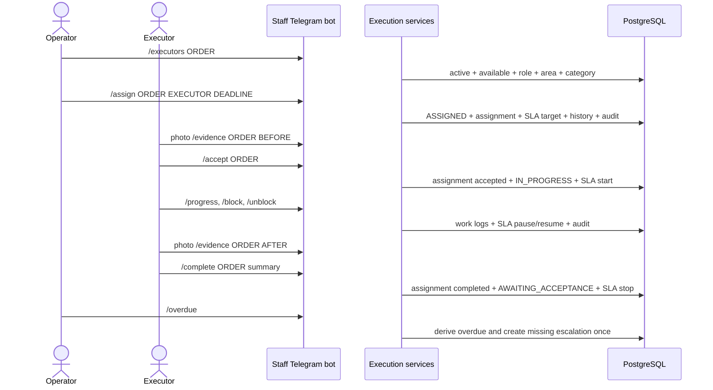

# Interaction sequence diagrams

## Resident request intake

```mermaid
sequenceDiagram
    actor Resident
    participant Bot as grammY adapter
    participant Controller as Telegram controller
    participant Intake as HandleResidentUpdateService
    participant UoW as PostgreSQL intake unit of work
    participant DB as PostgreSQL

    Resident->>Bot: /start or Telegram update
    Bot->>Controller: normalized command (update ID + Telegram user ID)
    Controller->>Intake: execute(command)
    Intake->>UoW: process(command, pure planner)
    UoW->>DB: claim unique update receipt
    UoW->>DB: per-user transaction lock + load session/catalog
    UoW->>Intake: planner(context)
    Intake-->>UoW: next session + response + optional submit intent
    alt confirmation
        UoW->>DB: address + request + initial history + audit + photo metadata
        UoW->>DB: clear submitted conversation draft
    end
    UoW->>DB: persist response and session; commit
    UoW-->>Controller: replayable localized response model
    Controller-->>Bot: rendered text and keyboard
    Bot-->>Resident: reply
```

## Retry and concurrent confirmation

```mermaid
sequenceDiagram
    participant A as Telegram delivery A
    participant B as Telegram retry B
    participant DB as PostgreSQL

    par same update ID
        A->>DB: insert update receipt
        B->>DB: insert same update receipt
    end
    DB-->>A: claim succeeds
    A->>DB: create request and stored response; commit
    DB-->>B: unique conflict; read stored response
    Note over A,B: both callers receive one ticket; only one request exists

    par different confirmation updates
        A->>DB: advisory transaction lock for Telegram user
        B->>DB: waits for same user lock
    end
    A->>DB: REVIEW → SUBMITTED and commit
    B->>DB: reload SUBMITTED session; no second submission
```

Telegram network replies occur after commit. If delivery of the reply fails, Telegram may retry the update and the stored response is replayed without repeating the database mutation.

## Assignment and executor delivery



## Staff validation and registration

```mermaid
sequenceDiagram
    actor Staff
    participant Bot as Staff Telegram bot
    participant App as Authorized application services
    participant DB as PostgreSQL

    Staff->>Bot: /validate TICKET
    Bot->>App: Telegram user + normalized command
    App->>DB: load active user and area grants
    App->>DB: RECEIVED -> VALIDATING + history + audit
    Staff->>Bot: /triage TICKET factors
    App->>DB: load source confidence + active model
    App->>DB: store factors, explanation, score and band
    Staff->>Bot: /duplicates TICKET
    App->>DB: store deterministic suggestions
    Staff->>Bot: /duplicate ... confirm|dismiss
    App->>DB: store human decision + audit
    Staff->>Bot: /register TICKET
    App->>DB: compare request version
    alt confirmed counterpart already has an order
        App->>DB: link preserved request to existing order
    else no linked counterpart
        App->>DB: allocate order number and create prioritized order
    end
    App->>DB: status history + audit; commit atomically
```

## Quality acceptance and controlled complaint reopen

```mermaid
sequenceDiagram
    actor Executor
    actor Resident
    actor Operator
    participant Bot as Telegram bots
    participant Quality as Quality service
    participant DB as PostgreSQL

    Executor->>Bot: /complete ORDER summary
    Bot->>DB: AWAITING_ACCEPTANCE + completion history
    Operator->>Bot: /checklist ORDER, /inspect ORDER results
    Quality->>DB: versioned inspection + audit
    Resident->>Bot: /accept ORDER
    Quality->>DB: verify owner + policy + passing inspection
    Quality->>DB: COMPLETED + acceptance + warranty + history/audit
    Resident->>Bot: /rate ORDER 1..5 comment
    Quality->>DB: one bounded rating
    Resident->>Bot: /complaint ORDER reason
    Quality->>DB: OPEN complaint + review deadline (order remains COMPLETED)
    Operator->>Bot: /reopen COMPLAINT reason
    Quality->>DB: verify scope/open link; REWORK_REQUIRED + assignment + SLA + audit
    Executor->>Bot: /startrework ORDER
    Quality->>DB: IN_PROGRESS + accept rework assignment + SLA start
```
