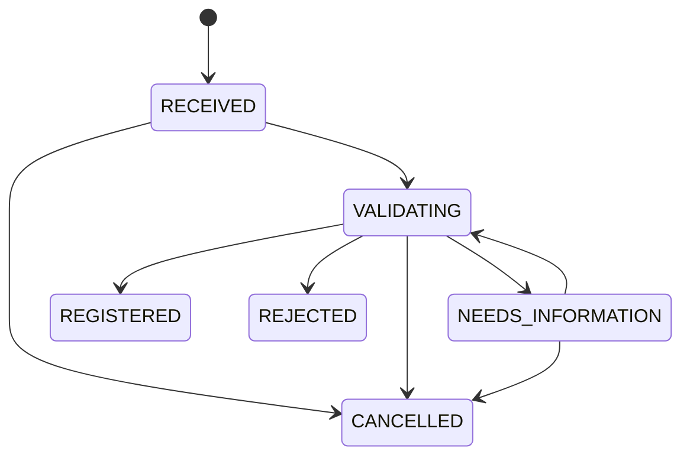
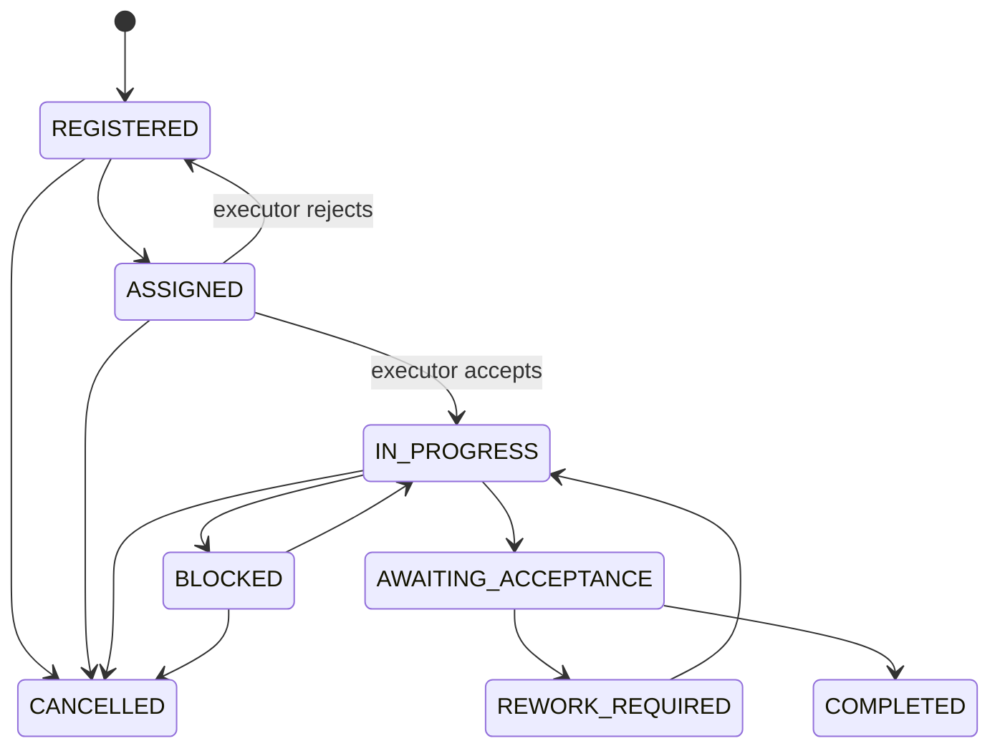

# Canonical request and order state machines

The executable definitions in `src/domain/requests/request-state-machine.ts` and `src/domain/orders/order-state-machine.ts` are the source of truth. Controllers, bot handlers, and SQL scripts must never set lifecycle status directly.

## Request lifecycle

| From → to                                         | Permission / actor                                  | Preconditions and required data                             | Side effect, notification, SLA, audit                                                        |
| ------------------------------------------------- | --------------------------------------------------- | ----------------------------------------------------------- | -------------------------------------------------------------------------------------------- |
| RECEIVED → VALIDATING                             | `request.validate`, area-scoped                     | source, requester, category, location exist                 | append history; resident status; start validation; `request.validation_started`              |
| VALIDATING → NEEDS_INFORMATION                    | `request.request_information`, area-scoped          | missing information is clear; `informationRequest` required | record request + history; notify resident; pause SLA; `request.information_requested`        |
| NEEDS_INFORMATION → VALIDATING                    | requester, or `request.provide_information` in area | actor policy satisfied                                      | append history; resident status; resume SLA; `request.information_provided`                  |
| VALIDATING → REGISTERED                           | `request.register`, area-scoped                     | validation and duplicate review complete                    | link/create order atomically + history; resident status; no SLA change; `request.registered` |
| VALIDATING → REJECTED                             | `request.reject`, area-scoped                       | approved rejection rule; `rejectionReason` required         | record reason + history; resident status; no SLA change; `request.rejected`                  |
| RECEIVED/VALIDATING/NEEDS_INFORMATION → CANCELLED | requester only                                      | `cancellationReason` required                               | record reason + history; resident status; no SLA change; `request.cancelled`                 |

## Order lifecycle

| From → to                                           | Permission / actor                          | Preconditions and required data                                         | Side effect, notification, SLA, audit                                            |
| --------------------------------------------------- | ------------------------------------------- | ----------------------------------------------------------------------- | -------------------------------------------------------------------------------- |
| REGISTERED → ASSIGNED                               | `order.assign`, area-scoped                 | active/available scoped and category-capable executor; future `dueAt`   | pending assignment + SLA target + executor/deadline + history/audit              |
| ASSIGNED → REGISTERED                               | `assignment.respond`, current executor      | `reason` required                                                       | declined assignment preserved; clear projection; stop clock; history/audit       |
| ASSIGNED → IN_PROGRESS                              | `assignment.respond`, current executor      | actor is assigned                                                       | accept assignment; start execution SLA; history/audit                            |
| IN_PROGRESS → BLOCKED                               | `order.update_progress`, current executor   | `blockerReason` required                                                | blocked work log; pause SLA; history/audit                                       |
| BLOCKED → IN_PROGRESS                               | `order.update_progress`, current executor   | blocker resolved                                                        | unblocked work log; accumulate paused time; history/audit                        |
| IN_PROGRESS → AWAITING_ACCEPTANCE                   | `order.submit_completion`, current executor | `completionSummary` required; optional controlled evidence              | completion log; complete assignment; stop SLA; history/audit                     |
| AWAITING_ACCEPTANCE → REWORK_REQUIRED               | `quality.require_rework`, area-scoped       | authorized inspector/customer policy; `reworkReason` required           | record reason + history; notify executor; no SLA change; `order.rework_required` |
| REWORK_REQUIRED → IN_PROGRESS                       | `order.start_rework`, current executor      | actor is assigned                                                       | history; resident status; start execution SLA; `order.rework_started`            |
| AWAITING_ACCEPTANCE → COMPLETED                     | `quality.accept`, area-scoped               | acceptance authority satisfied                                          | set completion time + history; resident status; stop SLA; `order.completed`      |
| REGISTERED/ASSIGNED/IN_PROGRESS/BLOCKED → CANCELLED | `order.cancel`, area-scoped                 | policy allows current-stage cancellation; `cancellationReason` required | record reason + history; resident status; stop SLA; `order.cancelled`            |

## Uniform failure and compensation policy

Any failed permission, actor, state, required-data, deadline, eligibility, or optimistic-version check rejects the command without state change or notification. Repository writes are one database transaction, so a failed history/audit insert rolls back the status update. No compensating write is required. The request registration transition additionally requires request registration and order creation/linking to share a transaction when implemented in CP-04.

Notifications and SLA effects are declared metadata in CP-02; their durable dispatch and timers are implemented in CP-07.
