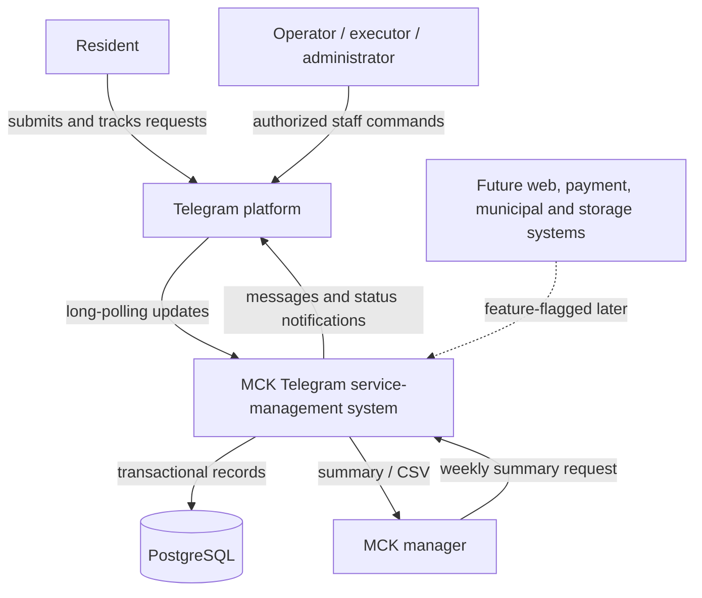
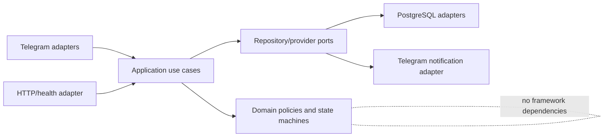

# Initial system context

This context is intentionally small. Container and component diagrams are CP-01/02
deliverables after the foundation and domain boundaries are approved.

## Trust boundaries

- Telegram update content is untrusted external input.
- A Telegram account is not staff until explicitly linked to an approved staff
  record.
- The resident and staff bots use separate tokens and command surfaces.
- Authorization is checked by application services for every sensitive command.
- PostgreSQL is the authoritative store for workflow, audit and idempotency.
- Telegram-hosted pilot photos are supporting material, not independent contractual
  storage.

## Core internal boundaries

The bot remains thin because conversation navigation, Telegram callbacks and update
delivery are channel concerns. Validation, authorization, idempotency, priority,
state transitions, audit and notification intent belong to reusable application or
domain services so future channels cannot bypass them.
